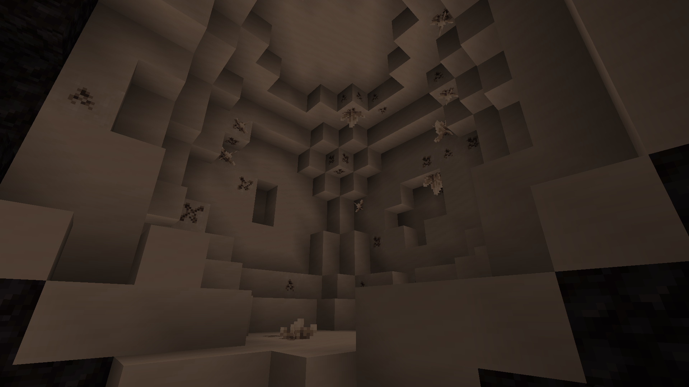

# Budding Nether Quartz

A small Minecraft mod that adds budding block and cluster versions of Nether Quartz in a similar fashion to Amethyst.
Designed primarily as a companion to Applied Energistics 2 to provide a counterpart for Certus Quartz, but made to work
independently and standalone if so desired.

